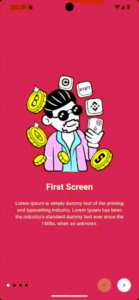

# Steps

[](https://github.com/carllosnc/steps/actions/workflows/dart.yml)

> A Flutter package that provides a simple way to create a step-based user interface.



## Usage

```dart
Scaffold(
  body: Center(
    child: ManualSteps(
      onExit: () {
        Navigator.pushNamed(context, "home");
      },
      screens: [
        ManualScreen(
          backgroundColor: Colors.red.shade600,
          content: const Column(
            mainAxisAlignment: MainAxisAlignment.center,
            crossAxisAlignment: CrossAxisAlignment.center,
            children: [
              //...
            ],
          ),
        ),
        ManualScreen(
          backgroundColor: Colors.red.shade700,
          content: const Column(
            mainAxisAlignment: MainAxisAlignment.center,
            crossAxisAlignment: CrossAxisAlignment.center,
            children: [
              //...
            ],
          ),
        ),
        ManualScreen(
          backgroundColor: Colors.red.shade800,
          content: const Column(
            mainAxisAlignment: MainAxisAlignment.center,
            crossAxisAlignment: CrossAxisAlignment.center,
            children: [
              //...
            ],
          ),
        )
      ],
    ),
  ),
)
```
---

Carlos Costa @ 2025